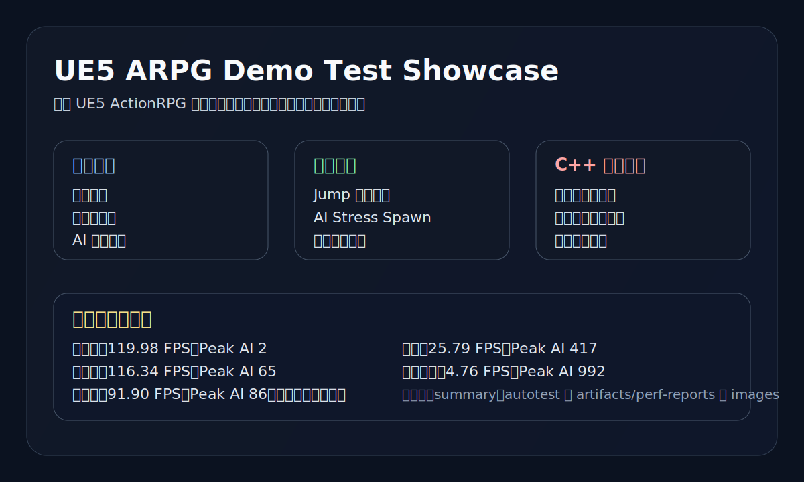
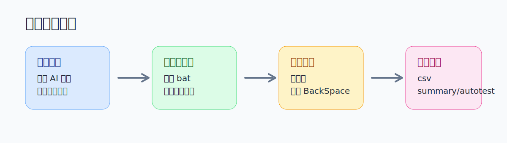

# UE5 ARPG Demo 测试与测开展示项目



基于开源 **UE5 ActionRPG** 样例工程做二次测试与扩展，重点不在重做一套 ARPG，而在于把一个现成项目打造成可分析、可压测、可沉淀结果的测试展示样本。

## 核心内容

- 围绕角色控制、战斗、掉落、背包、场景边界构建系统化测试
- 通过 `Jump`、`AI Stress Spawn`、资源替换实验扩大测试覆盖
- 通过 C++ 新增性能监控、自动化会话和关键链路埋点
- 输出真实 `csv / summary / autotest` 性能产物，保留可复盘样本

## 快速概览

| 方向 | 内容 |
|---|---|
| 基础项目 | UE5 ActionRPG 开源样例 |
| 测试重点 | 功能、边界、异常、压力、自动化回归 |
| 关键扩展 | Jump、AI Stress Spawn、资源替换实验 |
| C++ 扩展 | Performance Monitor、Automation Test、Profiling Scope |
| 结果产物 | PerfReports、趋势图、风险分析、代码样例 |

## 项目亮点

- 不是单纯试玩 Demo，而是围绕现成项目做系统拆解和测试治理
- 保留蓝图耦合、资源绑定等真实工程边界，在边界内增强可观测性和结果沉淀
- 压测结果不是只看 FPS，而是结合 AI 数量、对象累积、掉落膨胀、内存变化做综合分析
- 自动化重点放在测试会话调度、性能采样和报告生成，避免把展示重点浪费在脆弱的 GUI 操作上

## 测试流程



当前最稳妥的流程是：

1. 在编辑器中调整 AI 生成数量和范围
2. 运行 [run_rpg_automation.bat](run_rpg_automation.bat)
3. 进入场景后手动按一次 `BackSpace`
4. 等待自动记录并输出 `csv / summary / autotest`

默认推荐：

```bat
run_rpg_automation.bat autoplay
```

## 结果样本

### 趋势图


### 代表性结果

| 压力等级 | Average FPS | Peak AI | Peak Actors | Peak Pickup-Like Actors |
|---|---:|---:|---:|---:|
| 低负载 | 119.98 | 2 | 287 | 8 |
| 中负载 | 116.34 | 65 | 503 | 41 |
| 高负载 | 91.90 | 86 | 1010 | 485 |
| 重压 | 25.79 | 417 | 1617 | 99 |
| 极限过载 | 4.76 | 992 | 3834 | 591 |

完整代表性样本位于 [artifacts/perf-reports](artifacts/perf-reports)。

## 文档导航

### 项目总览

- [项目架构说明](docs/overview/PROJECT_ARCHITECTURE.md)
- [项目亮点](docs/overview/PROJECT_HIGHLIGHTS.md)
- [资源替换实验](docs/overview/RESOURCE_REPLACEMENT.md)

### 测试体系

- [测试体系说明](docs/testing/TESTING_SYSTEM.md)
- [核心测试用例](docs/testing/TEST_CASES.md)
- [缺陷与风险分析](docs/testing/BUG_REPORT.md)
- [AI 压力测试报告](docs/testing/PERFORMANCE_TEST.md)

### 扩展实现

- [AI Stress Spawner](docs/implementation/AI_STRESS_SPAWNER.md)
- [Jump 功能扩展](docs/implementation/JUMP_EXTENSION.md)
- [C++ 测试扩展](docs/implementation/CPP_TESTING_EXTENSIONS.md)
- [自动化与报告输出](docs/implementation/AUTOMATION_AND_REPORTING.md)

## 展示材料

### 性能报告样本

- [artifacts/perf-reports](artifacts/perf-reports)

### C++ 样例代码

- [code-samples](code-samples)

### 图像材料

- [AI Spawner 蓝图截图](images/ai_spawner_blueprint.png)
- [旧版性能图](images/ai_performance_charts.png)
- [新版趋势图](images/ai_performance_trends.svg)
- [项目总览图](images/project_showcase_overview.svg)
- [测试流程图](images/testing_pipeline.svg)

## 仓库结构

```text
UE5-ARPG-Demo-Test/
├── README.md
├── run_rpg_automation.bat
├── artifacts/
│   └── perf-reports/
│       └── representative summary/autotest samples
├── code-samples/
│   ├── RPGPerformanceMonitorSubsystem.h
│   ├── RPGPerformanceMonitorSubsystem.cpp
│   ├── RPGAutomationTestSubsystem.h
│   └── RPGAutomationTestSubsystem.cpp
├── docs/
│   ├── overview/
│   │   ├── PROJECT_ARCHITECTURE.md
│   │   ├── PROJECT_HIGHLIGHTS.md
│   │   └── RESOURCE_REPLACEMENT.md
│   ├── testing/
│   │   ├── TESTING_SYSTEM.md
│   │   ├── TEST_CASES.md
│   │   ├── BUG_REPORT.md
│   │   └── PERFORMANCE_TEST.md
│   └── implementation/
│       ├── AI_STRESS_SPAWNER.md
│       ├── JUMP_EXTENSION.md
│       ├── CPP_TESTING_EXTENSIONS.md
│       └── AUTOMATION_AND_REPORTING.md
└── images/
    ├── ai_spawner_blueprint.png
    ├── ai_performance_charts.png
    ├── ai_performance_trends.svg
    ├── project_showcase_overview.svg
    └── testing_pipeline.svg
```

## 参考项目

原始项目来源：

- https://github.com/vahabahmadvand/ActionRPG_UE5

本仓库用于展示基于该样例工程开展的测试分析、扩展实践与自动化成果，不作为原项目源码的完整再发布版本。
