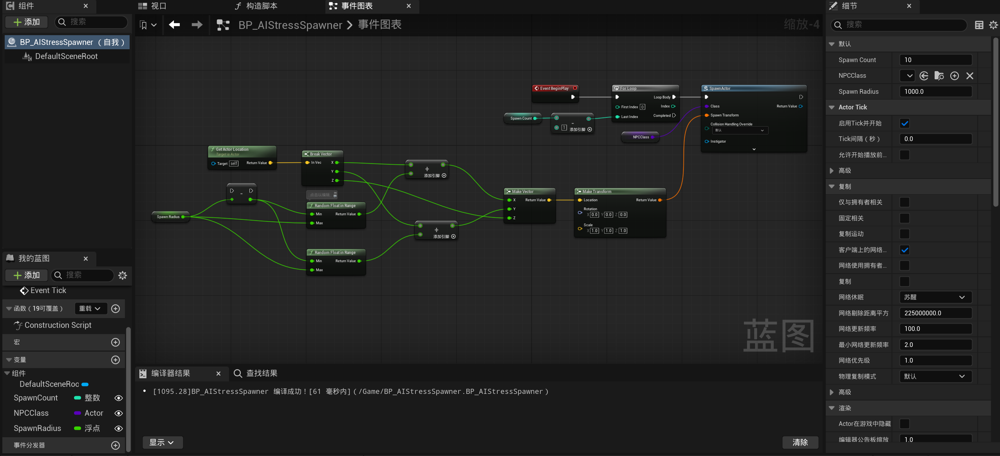
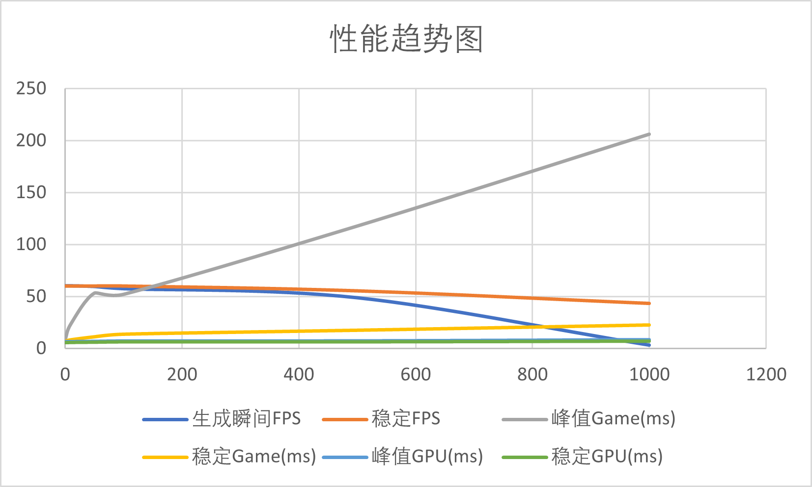

# 性能与压力测试报告

## 1. 测试目的

验证项目在不同 AI 数量场景下的性能表现，并分析高密度 AI 条件下系统的稳定性变化。

本次测试重点关注：

- AI 批量生成阶段的性能峰值
- AI 初始化完成后的稳定运行表现
- CPU 与 GPU 的性能瓶颈分布

重点观察指标：

- FPS（帧率）
- Frame Time
- Game Thread 时间
- GPU Time

---

# 2. 测试环境

| 项目 | 配置 |
|-----|------|
| 引擎版本 | Unreal Engine 5.7 |
| 操作系统 | Windows 11 |
| CPU | Intel Core i9-13900H |
| GPU | NVIDIA GeForce RTX 4060 Laptop GPU |
| 内存 | 32 GB |
| 分辨率 | 1920 × 1080 |
| 测试地图 | ActionRPG_P |
| 运行方式 | Play In Editor（PIE） |
| 性能监控 | `stat fps` / `stat unit` / `stat unitgraph` |

---

# 3. AI Stress Spawner

为了构造 AI 压力测试场景，实现了一个 **AI Stress Spawner（AI 批量生成器）**。

该工具可在游戏开始时自动生成指定数量的 AI，用于构建不同规模的测试场景。

可配置参数：

- **SpawnCount**：生成 AI 数量
- **SpawnRadius**：AI 生成范围半径

核心逻辑：

`BeginPlay → ForLoop → 随机生成偏移坐标 → SpawnActor (NPC)`

蓝图实现：

通过该工具可以快速构建高密度 AI 场景，从而进行性能压力测试。

---

# 4. 测试方法

通过调整 **SpawnCount** 参数构造不同 AI 密度场景：

- 基线状态（0 AI）
- 10 AI
- 50 AI
- 100 AI
- 500 AI
- 1000 AI

运行游戏后开启性能监控：

`stat fps` / `stat unit` / `stat unitgraph`

每组测试主要观察两个阶段：

### AI 批量生成阶段

游戏开始时 AI 被批量 Spawn，此阶段可能出现明显性能峰值。

### AI 初始化完成后的稳定阶段

AI 初始化完成后观察系统是否恢复稳定运行。

说明：

- **峰值数据**：AI 批量生成瞬间采样值  
- **稳定数据**：AI 初始化完成后约 5 秒的平均表现  

---

# 5. 测试结果

| 场景 | AI数量 | 峰值FPS | 稳定FPS | 峰值Game(ms) | 稳定Game(ms) | 峰值GPU(ms) | 稳定GPU(ms) | 现象 |
|----|----|----|----|----|----|----|----|----|
| 基线 | 0 | 60.00 | 60.00 | 8.43 | 7.12 | 6.49 | 5.39 | 基准性能 |
| 压测1 | 10 | 60.00 | 60.00 | 23.81 | 8.47 | 6.60 | 5.59 | 几乎无影响 |
| 压测2 | 50 | 59.34 | 60.00 | 53.24 | 11.31 | 6.81 | 5.84 | 生成阶段出现明显波动 |
| 压测3 | 100 | 57.25 | 60.00 | 52.12 | 13.83 | 7.22 | 6.17 | 与50 AI相比变化不大 |
| 压测4 | 500 | 48.58 | 55.37 | 117.87 | 17.63 | 7.38 | 6.23 | 初始化压力明显增加 |
| 压测5 | 1000 | 3.13 | 43.35 | 206.31 | 22.69 | 8.62 | 6.89 | CPU峰值显著 |

---

# 6. 视频记录

测试场景运行视频：https://www.bilibili.com/video/BV1W2NGzMEJh

视频记录了：
- AI 0 → 10 → 50 → 100 → 500 → 1000
- AI 批量生成瞬间的性能波动
- AI 初始化完成后的稳定运行状态

---

# 7. 性能趋势分析

下图展示了 **AI 数量与各项性能指标之间的变化趋势**：

从测试结果可以观察到：

- 随着 AI 数量增加，Game Thread 时间整体呈上升趋势，FPS呈下降趋势
- AI 批量生成阶段会出现明显性能峰值
- AI 初始化完成后系统性能逐渐恢复稳定

GPU 时间变化较小，说明当前测试场景的主要压力来自 **CPU 侧 AI 逻辑计算**。

---

# 8. 性能瓶颈分析

在高密度 AI 场景下，性能压力主要集中在 **AI 批量生成阶段**。

监控数据显示：

- Game ≈ 206 ms
- GPU ≈ 8 ms

说明：

- CPU（Game Thread）成为主要性能瓶颈
- GPU 渲染压力整体较低

可能的性能开销来源包括：

- `SpawnActor` 批量创建 Actor
- AI Controller 初始化
- Behavior Tree 启动
- Navigation 注册
- Collision 组件初始化

---

# 9. 结论

通过 AI Stress Spawner 构造不同规模 AI 场景，可以有效观察系统在高密度 AI 条件下的性能表现。

测试结果表明：

1. AI 数量增加会导致 **生成阶段出现明显性能峰值**
2. AI 初始化完成后系统运行逐渐恢复稳定
3. 当前性能瓶颈主要集中在 **Game Thread（CPU）**
4. GPU 渲染压力整体较低

因此当前项目的性能压力主要来自 **AI 生成与初始化阶段，而非持续运行阶段**。

---

# 10. 后续优化方向

可能的优化方向包括：

- AI 分批生成（避免瞬时 Spawn 峰值）
- 降低 AI Tick 频率
- 行为树优化
- AI LOD（远距离 AI 简化逻辑）
- 减少不必要的 Actor Tick
