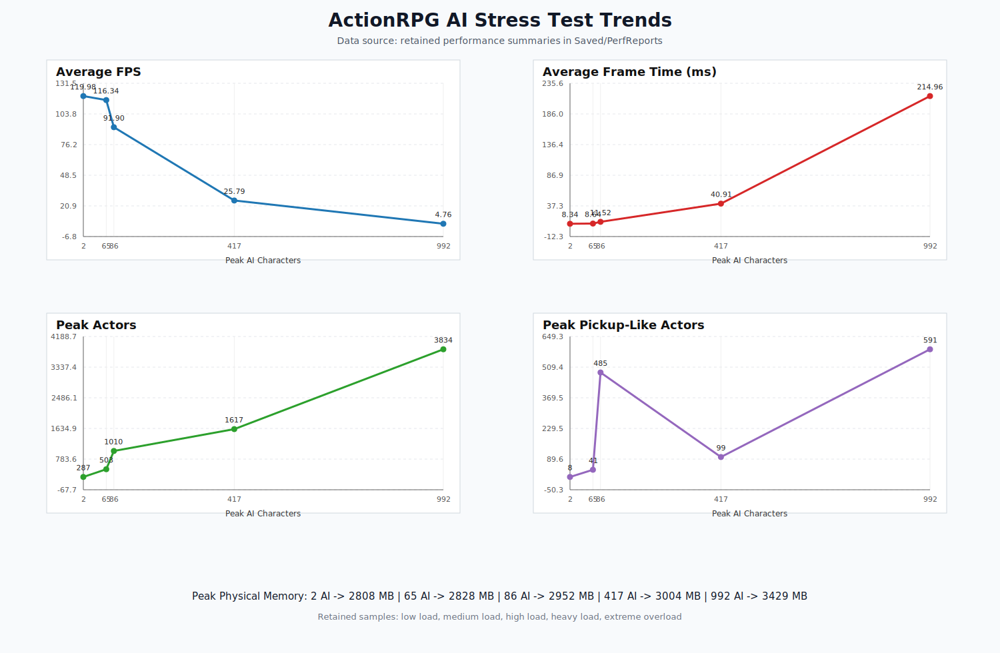

# AI 压力测试报告

## 概述

本报告基于项目保留的有效 `PerfReports` 样本，对 AI 梯度压测结果进行整理和分析。

测试重点关注：

- AI 数量增长后的帧率退化
- 对象数量与内存占用变化
- AI 互相攻击、死亡、掉落叠加后的综合负载
- 当前瓶颈更偏向 CPU 逻辑侧还是渲染侧

## 测试环境

| 项目 | 配置 |
|---|---|
| 引擎版本 | Unreal Engine 5.7 |
| 操作系统 | Windows 11 |
| CPU | Intel Core i9-13900H |
| GPU | NVIDIA GeForce RTX 4060 Laptop GPU |
| 内存 | 32 GB |
| 分辨率 | 1920 × 1080 |
| 测试地图 | `ActionRPG_P` |
| 行为触发 | 进入场景后手动按一次 `BackSpace` |
| 监控方式 | C++ 监控子系统 + `stat` 命令 + 自动化报告 |

## 测试方法

本轮采用 AI 数量梯度压测方法。需要强调的是，这里的压力不是“静态站桩 AI 数量”，而是：

- AI 生成
- AI 初始化
- 寻路与战斗行为
- AI 互相攻击
- 死亡与掉落
- 对象累积

共同形成的综合负载。

## 代表性样本

| 压力等级 | 文件 | AverageFPS | MinFPS | AverageFrameTimeMs | PeakActors | PeakAICharacters | PeakPickupLikeActors | PeakUsedPhysicalMB |
|---|---|---:|---:|---:|---:|---:|---:|---:|
| 低负载 | `RPGPerf_20260404_052355` | 119.98 | 118.38 | 8.335 | 287 | 2 | 8 | 2807.76 |
| 中负载 | `RPGPerf_20260404_055218` | 116.34 | 75.41 | 8.644 | 503 | 65 | 41 | 2827.50 |
| 高负载 | `RPGPerf_20260404_055446` | 91.90 | 34.64 | 11.518 | 1010 | 86 | 485 | 2951.75 |
| 重压 | `RPGPerf_20260404_060343` | 25.79 | 9.95 | 40.911 | 1617 | 417 | 99 | 3004.19 |
| 极限过载 | `RPGPerf_20260404_060554` | 4.76 | 3.82 | 214.956 | 3834 | 992 | 591 | 3429.40 |

## 趋势图

## 核心结论

### 1. 性能退化呈明显阶梯式而非线性

- 低到中负载阶段，平均 FPS 仍保持在 116 以上
- 高负载阶段下降到 91.90
- 重压阶段下降到 25.79
- 极限过载阶段下降到 4.76

说明对象规模一旦跨过某个阈值，项目会快速进入失控区间。

### 2. 主瓶颈更偏向 CPU 侧 AI 与对象管理链

依据是：

- `PeakAICharacters`、`PeakActors`、`PeakControllers` 增长时，平均 FPS 持续下滑
- 内存占用同步上升
- 掉落和拾取类对象数激增会进一步放大退化

更合理的判断是：

> 当前瓶颈更可能位于 CPU 侧的 AI、逻辑更新、对象生命周期管理链。GPU 是否存在次级瓶颈，仍需要结合 `profilegpu` 或 `Unreal Insights` 继续验证。

### 3. 压力来源是多阶段叠加

当前性能问题不能只归因于单一的 Spawn 峰值，还包括：

- 批量生成
- Pawn / Controller 初始化
- 行为启动
- 寻路参与
- 战斗、受击、死亡、掉落
- 对象累积

## 优化方向

按优先级排序，建议先做：

1. 分批生成，限制瞬时初始化峰值
2. 降低高密度 AI 的持续运行成本
3. 控制掉落和残留对象膨胀
4. 使用 `Unreal Insights` 和 `profilegpu` 做进一步定位

## 原始样本

完整代表性样本见：

- [artifacts/perf-reports](../../artifacts/perf-reports)
